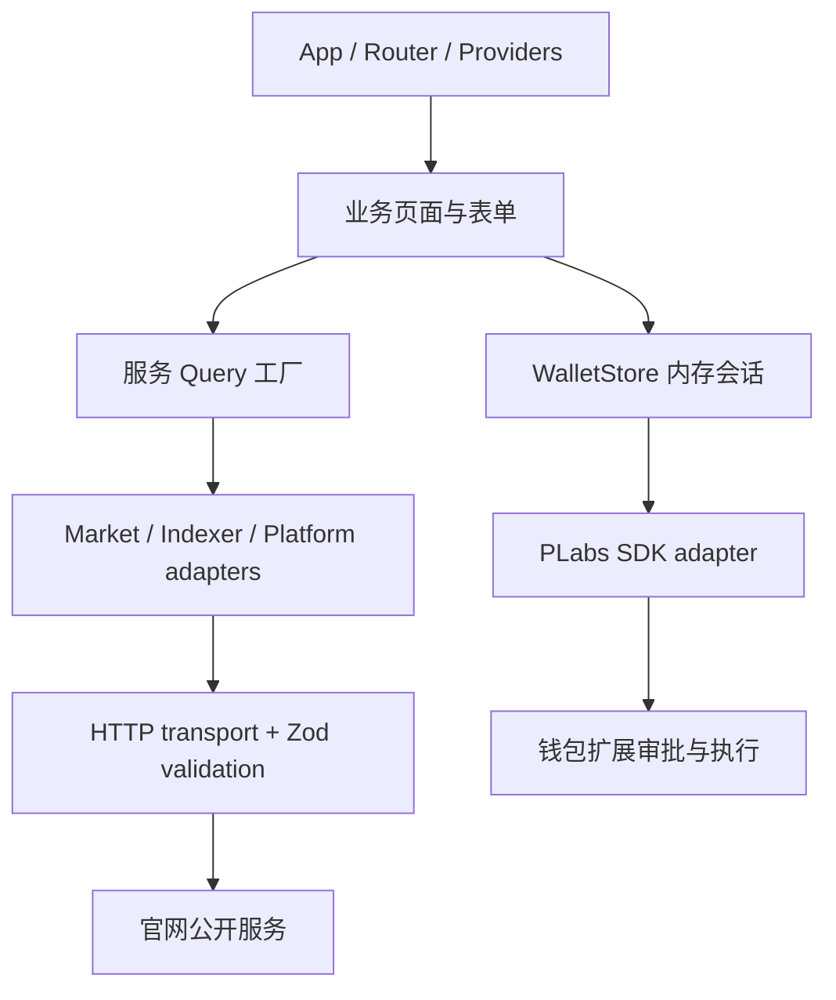

# 架构与状态归属

本项目是一个独立 SPA，采用按业务模块组织的分层结构，不引入尚无需要的微前端、多仓库或通用插件框架。

## 状态分工

| 状态                             | 持有者                     | 生命周期                                     |
| -------------------------------- | -------------------------- | -------------------------------------------- |
| 市场/网络/活动公开数据           | TanStack Query             | 按资源和网络构造 key；15 秒 stale，5 分钟 GC |
| 钱包账户、授权地址、交易意图结果 | WalletStore                | 仅内存；断开、网络/账户切换清除              |
| 表单                             | React Hook Form + Zod      | 页面生命周期                                 |
| 复核状态                         | 当前完整意图的 fingerprint | 修改数量、资产、地址或账户使复核失效         |
| 弹窗、过滤器、图表周期           | 对应业务组件               | 局部状态                                     |
| 主题与密度                       | CSS semantic tokens        | 全站固定深色主题                             |

## 后端边界

页面不使用 fetch、不拼接后端地址、不处理 snake_case DTO，也不自行假设价格或资产小数位。HTTP 客户端校验内容类型、状态码和 Zod 响应；适配器将 wire 格式转换为领域格式。金额意图始终为十进制字符串；仅行情显示使用 Number。

网页的公共 HTTP 层只提供 GET，凭证为 `omit`。私密订单状态的 POST /orders/status 由扩展对固定官网 Matcher 发起，不把私有查询材料交给网页。可重试错误限于网络、超时、429 与 5xx；契约错误及其他 4xx 不重试。钱包交易没有自动重试，避免重复资金动作。取消由 Query 的 AbortSignal 传入；超时固定 12 秒。

当前 API 没有 OpenAPI 来源，因此采用根据已验证线上响应建立、可执行的 Zod 契约，不生成臆测的接口。未来有 OpenAPI 时，可生成 DTO 到单独目录，保留领域转换和契约测试。

## 钱包隔离

`services/wallet` 是唯一导入 SDK 的服务目录，types.ts 仅转出协议 DTO，plabs-adapter.ts 封装实际调用。其他业务不接触 injected provider、EIP 消息或 RPC 方法字符串。WalletStore 通过可测试的 WalletAdapter 接口执行行为。

- 发现只读取已有权限，不触发连接或隐私地址审批。
- 调用连接按钮才请求账户；隐私地址在连接流程中请求单独批准；余额/历史/Notes/订单再按需授权。
- 所有异步动作经过单实例并发锁，防止重复提交。
- 每次账户/链变化递增 revision；旧请求完成后不能写入新会话。
- 扩展自己执行验证、选币、proving、费用计算和签名，本网站不索取私钥、查看密钥或 seed。
- 升级版插件通过 scoped read 协议提供余额和历史；授权不足时显示授权入口，未扫描时返回 null，不硬编码零余额或假同步率。

## 模块约束

`pnpm lint` 的第二步使用 TypeScript AST 检查静态 import、export 和动态 import。`shared` 不依赖业务；`services` 不依赖视图；`features` 不依赖 app，跨业务依赖仅允许 wallet；外部通过公共 index 导入。HTTP 与 SDK 入口也受检查。

## 视觉基础

以 Stitch 的 Obsidian 深色底、emerald/cyan 状态和等宽链上数据为基础。`tokens.css` 定义语义变量；`components.css` 描述共享控件；`features.css` 组织业务布局；`responsive.css` 明确桌面、平板、手机断点。Tailwind 用于局部布局工具，不在页面里复制大段主题值。

路由懒加载，图表单独分包，字体和用户提供的素材本地化。Radix 管理焦点与键盘交互；Motion 遵循系统 reduced-motion；移动端使用固定底栏，内容末尾保留安全空间。

## 取舍

- 单应用无需 Monorepo；未来第二个应用确实共享组件时再提取 package。
- 不增加全局 Redux/Zustand：Query 管服务端状态，钱包用可测的 external store，表单/视图用局部状态。
- Biome 与 Prettier 处理不同文件，CI 同时检查，避免循环格式化。
- 不将客户端日志直接发送至第三方。错误边界不会序列化钱包异常/状态；引入遥测前需定义脱敏策略和接收端。
